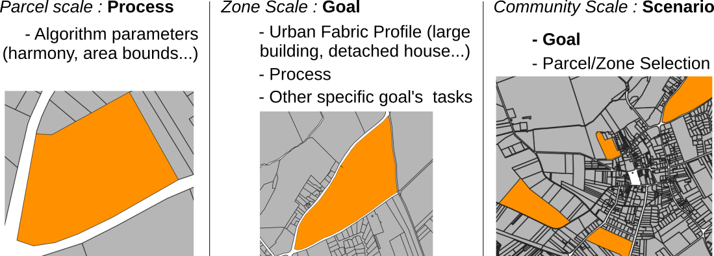

# Parcel Manager

Library providing functions, algorithms and workflows to process various parcel reshaping operations.
There are three way of using this library as shown in the schema bellow. 
<ul>
    <li>To divide a single parcel, choose one of the multiple implemented <b>processes</b>.</li>
    <li>To process various operations on a zone, use a <b>workflow</b> that runs various processes such as parcel division, agregation, or other (attribute attribution, sizes thresholds, etc.) </li>
    <li>On a community or on multiple communities, create advanced <b>scenarios</b> using simple .json files (<a href = "https://github.com/ArtiScales/ParcelManager/blob/master/src/main/resources/doc/scenarioCreation.md">see documentation here</a>).
Based</li>
</ul>
Library based on the function from the library <a href = "https://github.com/ArtiScales/ArtiScales-tools">ArtiScales-tools</a> (no stable version yet) and on the GeoTools 23.0 library.
JavaDoc is available <a href="https://artiscales.github.io/javadoc/ParcelManager/">here</a> and more can be found on a coming article and on the <a href = "https://www.theses.fr/2019PESC2070">PhD thesis of Maxime Colomb</a>.
.

Still under developpement.

## Description of packages

<ul>
<li><b>analysis</b>: Contains automated analysis tools to analyze urban fabrics and produce tables and graphs.</li>
<li><b>decomposition</b>: Contains the different <b>processes</b> of decomposition algorithms.</li>
<li><b>fields</b>: Contains methods and tools to automatically set feature informations on the generated parcels. Solutions for french parcels types and ArtiScales parcels types are implemented.</li>
<li><b>workflow</b>: Contains the different <b>workflows</b> for the parcel manager process. The three main workflows that are now implemented are: 
    <ul>
        <li><a href="https://github.com/ArtiScales/ParcelManager/blob/master/src/main/java/fr/ign/artiscales/workflow/ZoneDivision.java"><i>ZoneDivision</i></a>: Run a parcel division algorithm on an input zone</li>
        <li><a href="https://github.com/ArtiScales/ParcelManager/blob/master/src/main/java/fr/ign/artiscales/workflow/ConsolidationDivision.java"><i>ConsolidationDivision</i></a>: Merges predesigned parcel together and run a decomposition task</li>
        <li><a href="https://github.com/ArtiScales/ParcelManager/blob/master/src/main/java/fr/ign/artiscales/workflow/Densification.java"><i>Densification</i></a>: Run the densification process on the predesigned parcels</li>
    </ul>
</li>
<li><b>parcelFunction</b>: Various functions for single parcels, sort by type (collection, state, schemas, attribute, marking, etc.).</li>
<li><b>scenario</b>: Contains objects used for processing an automated simulation on a large zone (<a href="https://github.com/ArtiScales/ParcelManager/blob/master/src/main/resources/doc/scenarioCreation.md">technical description can be found here</a>).</li>
<li><b>workflow</b>: Cerate automated workflows for Parcel Manager which apply different workflows on specified zones</li>
</ul>
 

