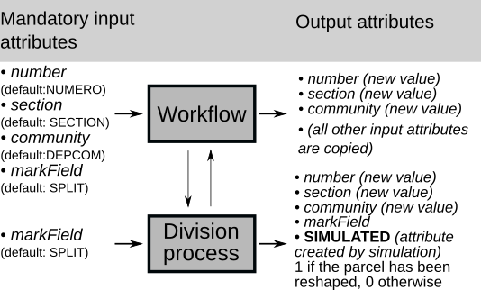

# Field Attributes

## Parcel Marking
A specific attribute called *markingField* is required to select which parcels can be reshaped by simulation. By default, the value of this specific atribute is set in a field named <b>SPLIT</b>. If the attribute value is set to 1, the corresponding parcel can be reshaped. Methods from the <a href="https://framagit.org/artiscales/parcelmanager/-/blob/master/src/main/java/fr/ign/artiscales/pm/parcelFunction/MarkParcelAttributeFromPosition.java">MarkParcelAttributeFromPosition</a> class can be used to automatically set the attribute values of the field *markingField* for all parcels. 

## Parcel ID

The parcel nomenclature of Parcel Manager simply works with three basic fields, defined as follows:
<ul>
    <li>The <i>community field</i> sets the unique identifier of the community (it can be a zipcode or a statistical code). Its default name is '<b>DEPCOM</b>'</li>
    <li>The <i>section field</i> identifies a zone, which must be unique in each community. Its default name is '<b>SECTION</b>'</li>
    <li>The <i>number field</i> is a unique number that identifies each parcel within each section. Its default name is '<b>NUMERO</b>'</li>
</ul>
Those three attributes are used in all Parcel Manager workflows.
Reshaped parcels have a new <i>section</i> value, based on the value of the <a href="https://framagit.org/artiscales/parcelmanager/-/blob/master/src/main/java/fr/ign/artiscales/pm/workflow/Workflow.java">abstract workflow.Workflow.makeNewSection()</a> method. This value is automatically incremented.
<i>Number</i> value is also incremented for each new zone.

It is possible to convert the basic nomemclature of Parcel Manager into another nomenclature and vice versa using specific methods. See for instance <i>frenchParcelToMinParcel(...)</i> from the <a href="https://framagit.org/artiscales/parcelmanager/-/blob/master/src/main/java/fr/ign/artiscales/pm/fields/french/FrenchParcelFields.java">fields.french.FrenchParcelFields</a> class, and  <i>setOriginalFrenchParcelAttributes(...)</i>.

## Attributes of input parcels
As shown on to the diagram below, input parcels must have some specific attributes.
  
Only the parcels with their *markingField* set to 1 can be reshaped. The output attributes of the reshaped parcels contain the same initial fields, plus a **SIMULATED** field that is created once the parcels have been reshaped. 
  
*community*, *section*, *number* and *markingField* fields must be completed in order to apply a workflow. In case of the **ZoneDivision** workflow, the *markingField* attribute is not mandatory. Value of fields *community*, *section* and *number* change once a parcel is reshaped (see section above). As a reshaped parcel is not the children of one unique parent parcel, all other fields are set to *null*. It is possible to detect if a section has changed with the *Workflow.isNewSection()* abstract method. 
  
  

## Zoning plan

The attribute table of a zoning plan must contain two fields:

<ul>
    <li>a <i>generic name</i> sets the general characteristics of each zone of the zoning plan. Its default name is '<b>TYPEZONE</b>'. Its default attribute values are:
<ul>
    <li> <b>U</b>: Fully urbanized zone,</li>
    <li> <b>AU</b>: Non urbanized zone in which new developments are authorized,</li>
    <li> <b>N</b>: Non urbanized zone in which new developments are not authorized.</li>
</ul>
    <li>a <i>precise name</i> which defines special rules that apply to a zone. Its default name is '<b>LIBELLE</b>'.</li>
</ul>

The default attribute tables of Parcel Manager can be modified easily.
To do this, the <i>fields.GeneralField.parcelFieldType</i> value must be changed and methods using this value must be fulfilled. 
